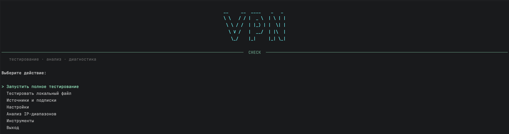

# VPNCheck

Консольный инструмент для массового тестирования VPN-конфигураций. Скачивает подписки, проверяет серверы через TCP, фильтрует рабочие, анализирует IP-диапазоны и опционально перепроверяет через **sing-box**.

## Интерфейс



## Возможности

- Интерактивное меню с навигацией (Spectre.Console)
- Подписки и собственные серверы в `sources.txt`
- Настройки в `settings.json` без редактирования кода
- Поддержка протоколов: VLESS, Trojan, VMess, Shadowsocks, Hysteria, Hysteria2
- Параллельное TCP-тестирование (до 256 потоков)
- DNS-резолвинг перед тестами
- Анализ IP-диапазонов (/24, /16) для настройки маршрутизации
- Перепроверка через sing-box (автоскачивание, опционально)
- Сборки для 6 платформ через GitHub Actions
- Локализация: русский по умолчанию, добавление языков через JSON

## Установка

Скачайте архив для своей платформы со страницы [Releases](../../releases):

| Платформа | Файл |
|---|---|
| Windows x64 | `VPNCheck-win-x64.zip` |
| Windows ARM64 | `VPNCheck-win-arm64.zip` |
| Linux x64 | `VPNCheck-linux-x64.zip` |
| Linux ARM64 | `VPNCheck-linux-arm64.zip` |
| macOS x64 | `VPNCheck-osx-x64.zip` |
| macOS ARM | `VPNCheck-osx-arm64.zip` |

Распакуйте архив — внутри исполняемый файл и `sources.txt`.

## Запуск

```bash
# Интерактивное меню
./VPNCheck

# Без меню — сразу запустить тест
./VPNCheck --run

# Тест локального файла (без скачивания подписок)
./VPNCheck --local

# Анализ IP-диапазонов по уже существующим результатам
./VPNCheck --analyze
```

## Файлы

```
VPNCheck          # исполняемый файл
sources.txt       # подписки и собственные серверы
settings.json     # настройки (создаётся автоматически)
```

После запуска создаются:
- `source_config.txt` — скачанные конфиги
- `successful_servers.txt` — прошедшие TCP-тест
- `output_config.txt` — отфильтрованный конфиг
- `ip_ranges.txt` — CIDR-диапазоны успешных серверов

## sources.txt

Файл создаётся автоматически с публичными подписками. Можно редактировать вручную или через меню приложения.

```
# Строки http:// и https:// — ссылки на подписки
https://example.com/subscription

# vless://, trojan://, vmess://, ss://, hysteria://, hysteria2:// — собственные серверы
vless://uuid@server.example.com:443?...

# Строки с # — комментарии
```

## Настройки

Управляются через меню → **Настройки**, сохраняются в `settings.json`.

| Параметр | По умолчанию | Описание |
|---|---|---|
| TCP таймаут | 3000 мс | Таймаут подключения к серверу |
| Параллельных тестов | 256 | Одновременных TCP-соединений |
| HTTP таймаут | 30 сек | Таймаут скачивания подписки |
| sing-box | включён | Перепроверка через sing-box |
| sing-box таймаут | 10 сек | Таймаут HTTP-проверки через sing-box |
| Параллельных sing-box | 50 | Одновременных sing-box тестов |

## Локализация

Строки интерфейса хранятся в `Localization/strings.ru.json` (встроен в бинарник). Для добавления нового языка:

1. Создайте `strings.xx.json` (где `xx` — код языка по ISO 639-1)
2. Скопируйте все ключи из `strings.ru.json` и переведите значения
3. Добавьте файл как `EmbeddedResource` в `.csproj`

Язык определяется автоматически по `CultureInfo.CurrentUICulture`. Если строка или язык не найдены — используется русский.

## Сборка из исходников

```bash
git clone https://github.com/akostt/vpn-config-tester.git
cd vpn-config-tester
dotnet build VPNCheck.csproj
```

Публикация для конкретной платформы:

```bash
dotnet publish VPNCheck.csproj -c Release -r linux-x64 --self-contained true /p:PublishSingleFile=true
```

## CI/CD

При создании тега `v*` GitHub Actions автоматически собирает бинарники для всех 6 платформ и публикует их в Releases.

```bash
git tag v1.0.0
git push origin v1.0.0
```

## Лицензия

Распространяется под лицензией **[MIT](LICENSE)**.

```
Copyright (c) 2026 akostt

Permission is hereby granted, free of charge, to any person obtaining a copy
of this software to use, copy, modify, merge, publish, distribute, sublicense,
and/or sell copies of the Software, subject to the following conditions:

The above copyright notice and this permission notice shall be included in all
copies or substantial portions of the Software.
```

Свободное использование, изменение и распространение — при указании авторства.
